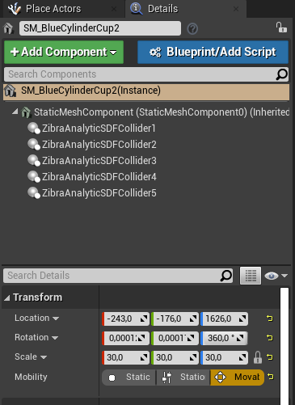
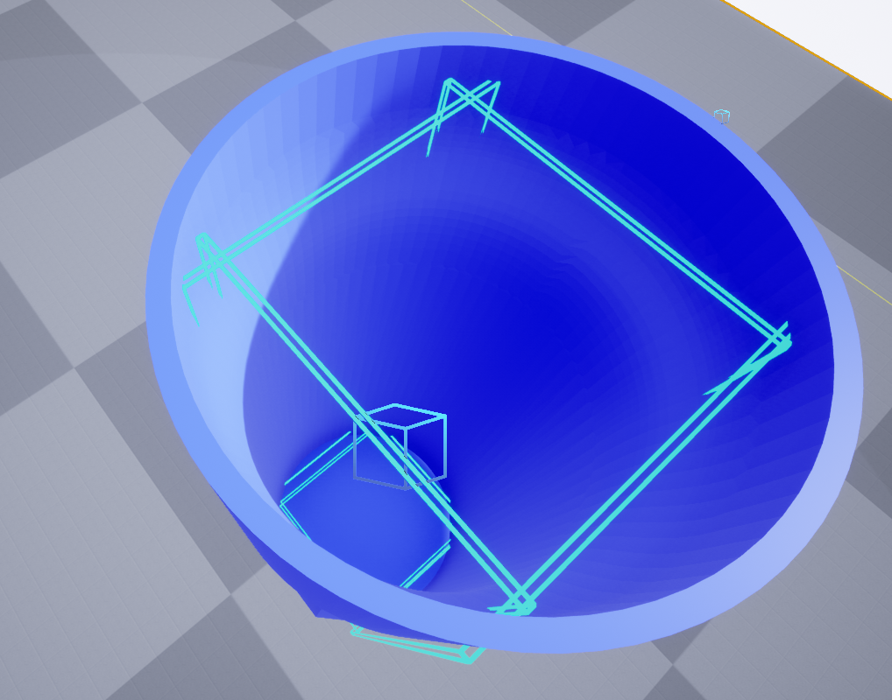
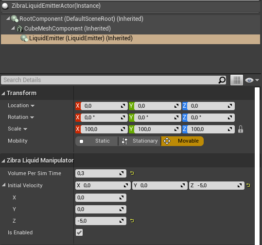
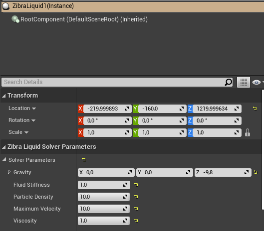
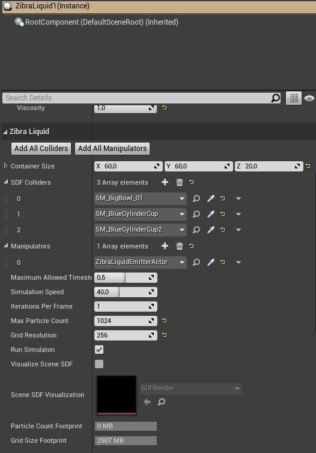
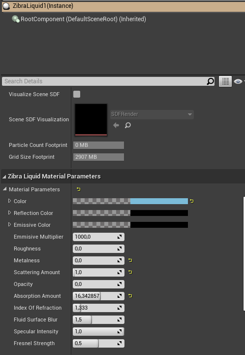

## Fluids_Zibra

### Key Actors

* **Zibra Liquid**
* **Zibra Liquid Emitter**
* **Blue Cylinder Cup** (Can be any Container with Zibra Collider Meshes)
* **Bowl** (Can be any Container with Zibra Collider Meshes)

### Building Zibra Collider Meshes with Primitve shapes (eg. Box, Cylinder)

* Adding five `ZibraAnalyticSDFCollider` components by taking the '_SDFType_' as '_BOX_'
  

* The five colliders should look as container by themselves, as shown below
  

## Zibra Liquid Emitter

* Is used to configure few parameters like **particles emitted per sec**, **initial velocity** and **volume per sim time**

## Zibra Liquid

* Is used to configure every important parameter related to setting manpulators, colliders, cylinder sizes, liquid solver parameters etc.,
Following figures shows different parameter options provides by Zibra liquid instance

* Parameters to change the liquid **viscocity**, **stiffness** and **particle density**

* Parameters to change the **cylinder size**, setting **SDF colliders**(Actors with SDF collider components to interact with),
**Manipulators**(liquid emitters to be used), **max particle count**, **simulation speed** etc.,

* Parameters to change the look and feel of the liquid with parameters like **colour**, **roughness**, **opacity**, **absorption amount** etc.,
  

## Reference

For a clear description of all the parameters and more, look at the official zibra documentation [here](https://drive.google.com/file/d/1o-5tgSxEr7orPAYc4uBbAsSGZUwCnVEK/edit)

## Usage

* Place the Cup and Bowl with Zibra collider components in to the level
* Place the liquid emmitter actor with required configuration setting
* Place the zibra liquid instance in to the level and set required cylinder size
* Add the cup and bowl as elements in the SDF colliders section
* Add the liquid emmiter actor as manipulator
* Set all the reamining parameters to required setting
* Place the liquid instance inside the cup to fill it with liquid when simulation begins
* Tilt the cup over the bowl 

## ToDo

* Prevent leakages while tilting by arranging box collider meshes properly
* Simualting different liquids like water, honey, blood etc.,
* Using zibra neural colliders (only in full version) 
